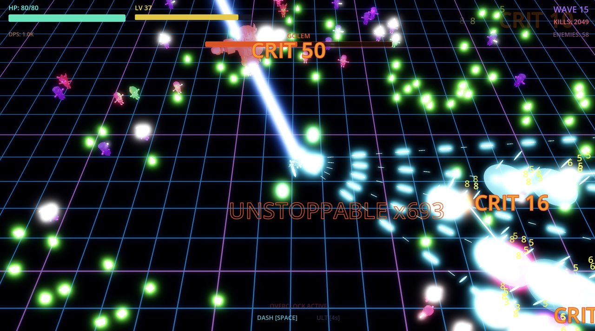

# VELOCITY NEON: HAPTIC HAVOC

A neon cyberpunk survivor game built with **Godot 4.6** — optimized for MacBook trackpad.




## About

3D world with 2D degrees of freedom — characters move on the XZ plane while the camera looks down at a ~55° angle. Survive endless waves of skeleton enemies, collect XP, level up, and choose upgrades to build an overpowered loadout.

## Controls

| Input | Action |
|-------|--------|
| **WASD / Arrows** | Move on the neon grid |
| **Auto-Aim** | Always targets nearest enemy |
| **Space** | Phase Dash — invincible + fire trail |
| **Q** | Ultimate — area damage burst |
| **Scroll Wheel** | Zoom camera in/out |
| **R** | Restart (game over) |
| **ESC** | Pause menu (Resume / Restart / Quit) |

## Features

### Combat
- **Auto-aim targeting** — always locks onto the nearest enemy
- **Critical hits** — 10% base crit chance for 2x damage with distinct orange VFX
- **Kill streaks** — rapid kills trigger escalating announcements (DOUBLE KILL through UNSTOPPABLE)
- **5 weapon systems** — Pulse Cannon (default), Railgun (piercing beam), Scatter Shot (shotgun cone), Chain Arc (bouncing lightning), Orbital Guard (orbiting damage spheres), plus Piercing Rounds and Ricochet upgrades
- **Phase Dash** — invincibility frames with after-image trail effect, fire trail, and dash cooldown ring indicator
- **Ultimate Ability** — area-of-effect burst with screen shake and hit-stop, cooldown scales down as you level up

### Enemies
Seven enemy types, each with a unique 3D model and neon glow:
- **Minion** — basic skeleton, low HP, moderate speed
- **Warrior** — armored, slow, high HP
- **Mage** — ranged specialist, purple glow, fires homing bolts from distance
- **Rogue** — fast and agile, green glow, periodically sidesteps to dodge projectiles
- **Necromancer** — ranged summoner, stays at distance and periodically summons minion skeletons with a purple VFX ring
- **Exploder** — fast yellow-glowing kamikaze, rushes the player and detonates on contact or death with area damage and chain-reaction potential
- **Golem** (Boss) — massive, spawns every 5th wave with dedicated boss music and ground slam AoE attack

### Progression
- Kill enemies to drop **XP orbs**
- Level up to choose **1 of 3 random upgrades**
- Upgrades include: fire rate, damage, max HP, move speed, projectile count, magnet range, HP regen, shatter-point, gravity well, overclock, phase shift (dash cooldown), piercing rounds, ricochet, and all 4 weapon unlocks
- **Wave survival bonus** — complete a wave without taking damage for bonus XP with "PERFECT WAVE" announcement
- **Level-up magnet pulse** — all XP orbs get pulled toward you when you level up

### Visuals & Audio
- **Neon cyberpunk aesthetic** — dark ground with animated grid shader, emissive materials, bloom/glow post-processing
- **Subtle screen shake** — gentle directional shake with logarithmic scaling
- **Hit-stop** — brief time freeze on heavy hits for impact feel
- **Boss HP bar** — dedicated top-center health bar during boss waves with fade-in/out
- **Floating damage numbers** — color-coded damage text on enemy hits, with big-hit scaling
- **Low HP danger vignette** — red pulsing screen edges when HP drops below 30%
- **HP bar color shift** — bar transitions from cyan to red at low health
- **Level-up flash + invincibility** — cyan screen flash and 1.5s invincibility after picking an upgrade
- **XP orb collect burst** — green ring flash + spark particles on orb pickup
- **Dash after-images** — translucent player copies trail behind during Phase Dash
- **Boss defeat celebration** — golden screen flash, victory sting, and "BOSS DEFEATED" announcement
- **Kill streak announcements** — DOUBLE KILL, TRIPLE KILL, MULTI KILL, KILLING SPREE, RAMPAGE, UNSTOPPABLE
- **Critical hit VFX** — orange CRIT text with larger font, extra knockback, and orange flash
- **Weapon glow scaling** — player light intensity and color shift as fire rate increases
- **Wave countdown timer** — shows time until next wave between rounds
- **Boss wave entrance** — dramatic scaled-up text with bounce animation for boss waves
- **Game over stats** — shows total damage dealt, kills/min, avg DPS alongside wave, kills, level, and time survived
- **Overclock HUD warning** — pulsing red indicator when overclock is active and draining HP
- **HP regen visual tick** — subtle "+HP" flash near health bar when regeneration heals
- **Pause menu** — ESC to pause with Resume, Restart, and Quit options
- **Time survived** — total survival time displayed on game over screen
- **Evolving soundtrack** — music rotates through 4 tracks as waves progress, with boss-specific tracks and victory stings
- **Full SFX** — shooting, impacts, deaths, XP pickups, level-ups, dashes, UI clicks, upgrade dice roll, hover sounds
- **Ambient neon hum** — low background drone that shifts pitch and volume as HP changes, adding tension at low health
- **Dash speed lines** — radial blur overlay during Phase Dash for kinetic feel
- **Enemy count HUD** — live enemy count display during waves
- **DPS counter** — real-time damage-per-second readout
- **Boss entrance zoom** — camera pulls out temporarily when a boss spawns for dramatic flair
- **Weapon-specific hit SFX** — distinct impact sounds for railgun, scatter, chain, and pulse weapons
- **XP orb size variation** — larger, golden orbs for high-value drops (boss XP vs regular)
- **No-damage wave indicator** — HUD shows "NO DAMAGE" when you're on track for a perfect wave bonus
- **Enemy spawn warning** — brief neon flash on the ground where enemies are about to appear
- **Dash cooldown ring** — radial ring around player shows dash readiness at a glance
- **Boss ground slam** — Golem periodically slams the ground dealing AoE damage and knockback when close
- **Victory music** — dedicated victory.ogg track plays on boss defeat instead of generic SFX

## Running

1. Install [Godot 4.6+](https://godotengine.org/download) (standard edition)
2. Clone this repo
3. Open `project.godot` in Godot
4. Press **F5** to run

```bash
git clone https://github.com/jiajie96/velocity-neon.git
```

## Project Structure

```
velocity_neon/
├── assets/
│   ├── audio/          # Music (OGG/MP3) + SFX (OGG)
│   ├── models/         # KayKit GLB models + textures
│   └── vfx/particles/  # Particle texture PNGs
├── scenes/
│   └── main.tscn       # Minimal root scene
├── scripts/
│   ├── autoload/
│   │   ├── audio_manager.gd   # SFX pool + music player
│   │   └── game_state.gd      # Global state singleton
│   ├── camera_rig.gd          # Camera follow + shake + hit-stop
│   ├── enemy.gd               # Enemy AI + death VFX
│   ├── enemy_spawner.gd       # Wave system
│   ├── hud.gd                 # UI + title screen + upgrades
│   ├── main.gd                # World builder
│   ├── player.gd              # Player + weapons
│   ├── projectile.gd          # Projectile + chain + VFX
│   ├── upgrade_system.gd      # Upgrade definitions
│   └── xp_orb.gd              # XP pickup
├── shaders/
│   └── grid_ground.gdshader   # Animated neon grid
├── ATTRIBUTION.md
├── FUTURE_IMPROVEMENTS.md
└── project.godot
```

## Credits

### 3D Models
- [KayKit Adventurers & Skeletons](https://kaylousberg.itch.io/) by Kay Lousberg

### Music (CC-BY 4.0)
- "Neon Runner" by Eric Matyas
- "Retro Synthwave Loops" by Tomasz Kucza (Magnesus)
- "Cyberpunk Battle" by Alexandr Zhelanov

See [ATTRIBUTION.md](ATTRIBUTION.md) for full details.
