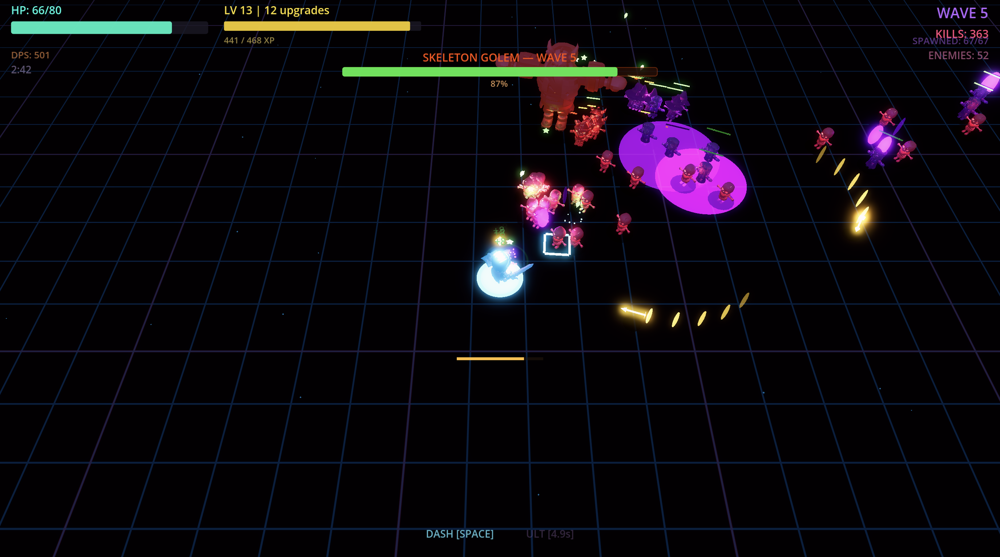

# Velocity Neon: Haptic Havoc

A top-down 3D action roguelike built in Godot 4.6 with a neon cyberpunk aesthetic.

Survive relentless waves of skeleton enemies, level up to choose powerful upgrades, and push deeper into the neon grid.



## How to Play

- **WASD / Arrows** — Move
- **Auto-Aim** — Shoots nearest enemy automatically
- **SPACE** — Phase Dash (invincible + brief escape grace + damage trail; banks multiple charges with the Phase Charge upgrade)
- **Q** — Ultimate Ability (area damage burst)
- **Scroll Wheel** — Zoom camera in/out
- **ESC** — Pause menu
- **M** — Mute / unmute all audio
- **R** — Reroll upgrade choices (level-up) / Restart (game over)
- **1/2/3** — Quick-select upgrades on level-up

## Features

### Combat
- Auto-aim primary weapon with laser bolt visuals and trail effects, plus a target reticle that marks the enemy you're currently locked onto — the reticle bleeds green on a healer, purple on a necromancer, orange-red on an exploder, and gold on an elite so you can read a priority target at a glance
- Build-tinted muzzle flash — the gun's flash matches the active bolt palette (Piercing → white-cyan, Ricochet → lime-green, both → blended)
- Critical hits (12% base chance, ★ damage text, orange screen flash, crisp crit ping + extra screen shake so they land hard)
- Kill streaks grant an escalating combo damage bonus (up to +40%) shown live on the streak banner (DOUBLE KILL through UNSTOPPABLE); the streak window is a forgiving 2.5s so combos are easier to sustain
- Laser bolts grow chunkier and longer as you stack damage, so a heavy Power Shot build *looks* as hard-hitting as it plays
- Phase Dash with afterimage trail, invincibility (plus a brief i-frame grace window past the dash for a reliable escape), contact damage scaling with speed, and audio-visual ready cue — carving through a pack now lands a meaty thud + a small camera kick the first time the dash connects; a slightly shorter base cooldown (1.4s) keeps you mobile
- Ultimate ability with screen-clearing AoE, multi-ring VFX, damage scaling with upgrades, and outward knockback that shoves enemies away for a panic-button "clear space" feel (bosses resist most of the push) — grants a reliable i-frame window on cast (0.55s) so pressing Q while swarmed actually buys an escape, with a base cooldown of 7.0s
- Gravity Well isn't just crowd control — slowed enemies also take +25% damage, so the slow field has a real offensive payoff
- Built-in comeback systems keep a bad run alive: **Last Stand** softens incoming hits by an extra ~15% while you're critically wounded (under 20% HP), enemies drop **health orbs far more often the lower your HP falls**, and a **flawless wave heals you ~10%** on top of the XP bonus
- Tiered hit VFX: chip hits get a cheap point-light flash while kills earn the full shockwave + spark burst, so sustained fire in dense waves stays smooth without losing impact on the moments that matter
- Heavy Multi-Shot volleys (3+ projectiles) fire a chunkier "scatter" report instead of the single-bolt pulse, so a stacked build sounds as big as it hits

### Weapons & Upgrades (29 upgrades)
- **Primary Stats**: Rapid Fire, Power Shot, Fortify, Swift, Multi-Shot, Magnet
- **Weapons**: Railgun (piercing beam), Signal Arrow (homing Yaka-style arrow that darts enemy-to-enemy — faster and harder-hitting each level), Chain Arc, Orbital Guard (orbiting damage orbs)
- **Combat**: Piercing Rounds, Ricochet (bolts now phase through enemies and keep bouncing off the walls until their bounces are spent — they ricochet around the arena instead of dying on first contact), Shatter Point, Critical Surge (each stack adds +5% crit chance **and** +0.15× crit damage), Velocity Rounds, Executioner (bonus damage to enemies under 35% HP, with red execution flash), Adrenaline (outgoing damage rises as *your* HP falls — up to +40% near death, a risk/reward boost that pairs with Vampire and dash i-frames)
- **Defense**: Nano Shield (with visible blue shield ring), Titanium Plating (+18% max HP **and** an instant heal per stack, up to 3 — a percentage boost that keeps scaling into late waves where flat Fortify falls off), Regeneration (+1.3 HP/sec per stack, with heal particle VFX), Vampire (2.5 HP lifesteal per kill, up to 3 stacks), Guardian Angel (one-time death save — a fatal hit instead leaves you at 35% HP with a protective cyan burst, a moment of invincibility, and a shockwave that shoves the surrounding swarm back so the revive actually buys room to recover), Thorns (reflect 25%/50% of contact damage back into enemies that touch you — a brawler pick for tanky builds)
- **Mobility**: Phase Charge (banks an extra dash **and** speeds up its recharge — stack to hold and chain multiple dashes), Phase Blades (+80% Phase Dash carve damage per stack **and** a wider carve radius, up to 2 — finally a payoff for a dash-centric build)
- **Utility**: Gravity Well (slowed enemies also take +25% damage), Greed (+20% XP from all sources, up to 3 stacks), Scavenger (health orbs drop more often **and** heal for more — a sustain pick for long runs, up to 2 stacks)
- **Slaying**: Giant Slayer (+22% damage to bosses per stack, up to 3 — helps an under-geared build close out a long golem fight)

### Enemies (9 types)
- **Skeleton Minion** — basic melee rusher
- **Skeleton Warrior** — tougher, with periodic lunge attacks that deal contact damage + knockback on impact (lunge frequency increases in later waves, SFX + ground dust VFX on landing)
- **Skeleton Mage** — ranged caster with telegraphed fire bolts, strafing orbit movement, speed scales with wave, retreat clamped to arena bounds
- **Skeleton Rogue** — fast with periodic sidestep dodge (dodge frequency increases in later waves)
- **Necromancer** — stays at range, summons minion waves, fires telegraphed purple bolts, speed scales with wave, retreat clamped to arena bounds
- **Exploder** — rushes player and arms a short fuse on contact (urgent beep + a hard danger ring) rather than detonating instantly, giving you a window to Phase Dash clear of the blast; still chain-reacts with nearby exploders and detonates if killed (blast damage scales with wave and falls off toward the edge)
- **Teleporter** — blinks to random positions near the player, unpredictable (blink frequency scales with wave)
- **Healer** — hangs back behind the swarm and pulses healing into nearby wounded enemies (green ring + shimmer telegraph the pulse, mended enemies glint green) — a priority target that undoes your chip damage if left alive (wave 4+)
- **Skeleton Golem** (Boss, every 5th wave) — multi-phase with slam, rock throw with ground target indicator (3-rock spread when enraged, fiery trail particles, distinct throw SFX), charge (with knockback, ground impact VFX), and enrage below 30% HP. Boss speed scales with wave progression. Defeating a boss awards bonus XP with dramatic gold flash
- **Elite variants** (wave 6+) — any regular enemy has a small, wave-scaling chance to spawn as a tougher, higher-value Elite: ~1.9× HP, faster, hits harder, drops ~2.2× XP and is much likelier to drop a heal orb. Marked with a gold rim glow, a floating gold chevron, a larger build, and an always-on HP bar so they read as priority/reward targets. **Splitting** — every elite bursts into two fresh minions when killed, so ignoring a gold target lets it refill the swarm (the split is capped to respect the alive-enemy limit, and the spawned minions are never elite so there's no runaway)
- Non-minion enemies (and all elites) display mini HP bars for target prioritization

### Audio
- Title screen ambient music (neon_runner) with crossfade into gameplay tracks
- Dynamic soundtrack that rotates across 9 tracks as waves progress — each early/mid-game wave tier you actually spend time in plays a distinct track (rotation centralized so the post-boss music resume always matches the current tier)
- Boss-specific music (cyberpunk_battle for early bosses, epic_boss for wave 10+)
- Defeat music on game over (somber track plays on death)
- Weapon-specific hit impact SFX (railgun, scatter, chain, pulse)
- Enemy death SFX varies by type (unique pitch ranges per enemy for audio variety)
- Ambient neon hum that shifts pitch based on HP
- Low HP heartbeat pulse (rhythmic thump below 25% HP, increases urgency)
- Critical hit ping (bright two-layer chime when a crit lands)
- Escalating kill-streak chime that climbs in pitch at streak milestones (3/5/8/12/16/20/25)
- Kill milestone celebratory SFX (distinct sound at 100/250/500/1000 kills)
- Perfect wave chime (bright ascending fanfare when the no-damage bonus lands)
- Healer pulse shimmer (soft restorative cue when a healer mends the swarm — audible even offscreen)
- Full UI sound effects (clicks, hovers, upgrade selection, wave start, level-up)
- Wave-start horn pitch climbs with wave depth — deeper waves announce themselves with a tenser, higher tone
- XP pickup pitch scaling (pentatonic climb on rapid collection)
- Big XP batch collection chime (satisfying sound when collecting many orbs at once)
- Dash ready audio cue when cooldown completes
- Ultimate ready audio cue when cooldown finishes
- Necromancer summon SFX (eerie pulse when minions spawn)
- Boss entrance sting (ominous low-end stinger announces a boss wave before the music swaps)
- Boss enrage roar (a distinct deep, snarling stinger when the golem drops below 30% HP — no longer recycles the plain slam sound)
- Ultimate "not ready" blip (a quiet, rate-limited denied cue when you press Q while it's still on cooldown)
- Heavy Multi-Shot volley SFX (chunky scatter report when firing 3+ projectiles at once)
- Golem charge telegraph SFX (low rumble before charge)
- Golem rock throw SFX (distinct deep whoosh, separate from slam)
- Orbital Guard hit SFX (subtle click when orbitals damage enemies)
- Dash-strike thud (a meaty impact the first time a Phase Dash carves through enemies, once per dash)
- Teleporter blink SFX (high-pitched warp sound on teleport)
- Player death SFX (dramatic low-pitched explosion on game over)
- Master mute toggle — press M (or use the pause-menu MUTE button) to silence/restore all audio via the master bus, with an on-screen indicator
- Warrior lunge SFX (impact grunt when warriors charge)
- Victory sting on wave 10/15/20/25 milestones
- Wave clear heal SFX (subtle chime when HP recovers between waves)
- Health pickup chime (bright two-layer chime when grabbing a dropped heal orb)
- 16-channel SFX pool for rich audio layering

### Visual Polish
- Neon cyberpunk aesthetic with bloom, glow, and emissive materials
- Enemy spawn-in scale pop (regular enemies grow in after their warning ring instead of appearing fully-formed on top of you)
- Auto-aim target reticle (spinning cyan bracket marks the locked-on enemy; scales up for bosses)
- Floating ambient neon motes drifting across the arena floor
- Damage vignette (red pulse at low HP), hit flash on damage taken
- Low-HP danger glow (the player's own light bleeds red and pulses faster below 25% HP — an at-a-glance companion to the heartbeat audio and the screen vignette)
- Screen flash on critical hits (orange tint)
- Green screen-edge pulse when grabbing a health pickup
- Punchy muzzle flash on every shot (brighter, snaps inward as it fades)
- Enemy hit-pop flares the whole model's glow white on hit (reads clearly even on multi-surface skeletons), then restores to its true resting neon glow
- Cyan Phase Dash trail unified with the dash afterimages, ring, and shockwave
- Speed lines during Phase Dash (radial shader)
- Directional screen shake on impacts and when you take a hit — bounded and hard-capped so dense swarms stay readable (hit-stop slow-mo is intentionally off to keep frame pacing smooth)
- Boss entrance: ominous warning sting + temporary camera zoom-out so you can read the arena
- Boss wave red flash + screenshake on wave announcement
- Dynamic camera zoom (pulls in for close combat, out for distant threats)
- Floating damage numbers (color-coded, scaled for big hits)
- Enemy death VFX (expanding rings + spark bursts, type-colored)
- Dash afterimages and ready-pulse ring indicator
- Regeneration heal particles (green sparkles rising from player)
- Enhanced projectile trails at high speed (denser, longer-lasting)
- Necromancer bolt telegraph (purple charge glow before firing)
- Teleporter blink-scatter death effect (ghost copies flash outward)
- Gravity Well visible radius ring (purple pulsing ring shows slow field area)
- Rogue dodge ghost trail (translucent afterimage on sidestep)
- Orbital Guard hit feedback (the orb flares brighter and pulses larger for a moment when it damages an enemy — allocation-free, so it stays cheap under heavy fire)
- Mage/Necromancer bolt trail particles (fading trail behind enemy projectiles)
- Player model damage flash (white flash on hit for clear feedback)
- XP orb spawn burst (orbs pop outward from kills before settling)
- Boss enrage arena red pulse (screen edge throb during enrage phase)
- Threat-scaled spawn warnings (bigger glow rings for dangerous enemy types)
- Nano Shield visible ring (blue pulse around player when damage reduction is active)
- Golem charge end ground impact ring (visual punctuation when charge stops)
- Boss enrage dust trail (red particles behind enraged golem for visual intensity)
- XP orb magnetize glow (orbs glow brighter when being pulled toward player)
- Weapon-colored damage numbers (railgun blue, scatter orange, chain cyan, orbital green)
- Level-up invincibility shield ring (cyan pulse ring during post-upgrade i-frames)
- Ultimate ready screen flash (purple screen-edge pulse when ult comes off cooldown)
- Title screen neon color cycle (animated title text with shifting neon colors)
- Enemy projectiles despawn at arena boundaries (prevents stale node buildup)
- Player shots ricochet and despawn against the *active* arena edge, so Ricochet bounces correctly off the shrunken boss-fight walls instead of passing through them — each wall bounce now sparks (impact flash + spark burst + a tiny shake) so the ricochet reads instead of silently changing direction
- Dash-colored damage numbers (cyan) when hitting enemies during Phase Dash
- Scatter shot cone flash (brief orange cone showing pellet spread direction)
- Gravity Well purple tint on slowed enemies (visual feedback for slow field)
- Warrior lunge ground dust (red particles on landing after lunge)
- Executioner red flash on low-HP enemy hits (makes the upgrade feel impactful)
- Warrior lunge emission properly resets after attack completes
- Exploder chain reaction lightning arcs between chained detonations
- Golem rock throw fiery trail particles
- Golem rock throw ground target indicator (red circle showing impact zone)
- Exploder detonation radius danger ring (pulsing warning as they approach)
- Damage i-frame visual indicator (cyan ring flash showing invulnerability window)
- Velocity Rounds visual scaling (faster projectiles have thicker, brighter trails)
- Build-tinted bolts — your pulse shots shift color with your build (Piercing → white-cyan, Ricochet → lime-green, both → blended) so upgrades read at a glance

### HUD & UI
- Corner minimap radar — plots the swarm relative to you (you're the cyan dot at center), with bosses shown in orange and elites in gold; off-radar contacts clamp to the edge so a distant threat still shows its bearing
- HP bar with color shift (cyan → red at low HP), overclock drain indicator
- XP bar with level counter, upgrade count, and a numeric current/next-XP readout so progress to the next upgrade is visible
- Boss HP bar with wave-specific label ("SKELETON GOLEM — WAVE X"), color shift (green → yellow → red), and enrage warning ("ENRAGED" + pulsing red)
- Boss defeat bonus XP announcement
- Live DPS meter, enemy count, survival timer
- Wave announcements with boss wave callouts
- Kill streak and milestone announcements, plus a draining combo-streak timer bar under the banner that shows how long the kill-streak window (and its damage bonus) has left
- No-damage wave indicator — a perfect (no-damage) wave clear now also lands a quick camera punch + shake on top of the chime and banner so the bonus feels earned
- Pause menu (resume/restart/mute/quit) with a live MUTE/UNMUTE toggle button, an at-a-glance run summary plus a full build sheet (damage, fire rate, projectiles, crit, DR, regen, lifesteal, XP bonus, Guardian status), and a compact controls reference (WASD / SPACE / Q / ESC / M)
- Upgrade reroll — one per level-up screen (button or R key) swaps all three choices
- Guardian Angel HUD badge while the death save is still banked
- Title screen shows your saved best run (wave + kills); game over shows a gold "★ NEW RECORD ★" banner when you beat it
- Floating red "-X" damage number above the player when you take a hit, so you can read how hard it landed
- Gold screen-edge flash on big kill-streak milestones (layered on top of the streak banner and rising audio sting)
- Level-up "powered up" world burst — a golden shockwave + spark flare at the player when an upgrade is confirmed
- Ultimate cooldown shows seconds remaining (e.g. "ULT [3.2s]") for precise timing
- Wave clear shows XP orb vacuum count (e.g. "WAVE CLEAR +12 ORBS")
- Game over screen with stats (damage dealt/taken, kills/min, DPS, best kill streak, total dashes, avg time/wave), performance rating, power level summary (GEARING UP/ARMED UP/FULLY LOADED/MAXED OUT), build summary, and restart button
- Victory sting plays on reaching wave 10, 15, 20, and 25 milestones
- Victory sting + milestone banner plays on reaching wave 10 (VETERAN), 15 (ELITE), 20 (LEGENDARY), and 25 (MYTHIC)
- XP bar golden glow pulse on level-up for satisfying visual feedback
- Title screen with controls reference
- Wave spawn progress counter (shows enemies spawned vs total)
- Upgrade stat preview (concrete before/after values on level-up cards, including all weapon upgrades)
- Wave countdown shows upcoming wave number and boss wave warnings
- Batched XP pickup text (rapid collection combines into one "+X XP" label)
- Enhanced death sequence (screen shake, red flash)
- Mini HP bars above elite enemies for target prioritization

### Game Systems
- Wave-based progression with aggressive scaling (enemy contact damage scales with wave); late-game wave sizes use a softened quadratic curve so the highest waves stay intense without becoming a slog, and the first two waves are eased (16 / 20 enemies) so a fresh run with base stats isn't an instant wall
- Health pickups: enemies have a small chance to drop heal orbs (elites likelier, bosses guaranteed) that restore HP scaled to max HP, with green VFX and a chime; heal orbs no longer magnetize or collect while you're at full HP, so a drop isn't wasted when you don't need it; grabbing one also grants a brief 0.5s i-frame window so a clutch heal in a swarm isn't instantly undone by the next contact hit
- Exploder blasts deal distance-scaled damage (full at the blast center, falling to 40% at the edge) so positioning matters and an edge clip is no longer a near-one-shot
- Multi-level-up: large XP gains (boss bonus, batched orbs) award every level crossed, offering each upgrade in turn instead of banking the overflow
- Kill-streak combo damage bonus that ramps with the streak and decays when it ends
- XP orbs auto-magnetize toward the player after a few seconds (and live a little longer) so earned XP isn't lost in chaotic waves
- Warrior lunge cooldown scales with wave for sustained threat in late game
- Exploder detonation damage scales with wave progression
- Perfect wave bonus XP (no damage taken)
- Wave clear heal bonus scales with max HP (rewards Fortify investment)
- Brief invulnerability on wave clear (1s breathing room)
- Phase Dash keeps a short i-frame grace after the dash ends, so phasing through a pack is a reliable escape
- Snappier Phase Dash cooldown (1.5s) for more responsive mobility
- Multi-source damage i-frame window (0.2s) so simultaneous hits in dense waves are fairer
- XP magnet pulse on level-up, wave clear, kill streaks (3+), boss defeat, and exploder chain reactions
- XP orbs fade out after 15 seconds to prevent late-game buildup
- Teleporter blink frequency scales with wave for increased late-game threat
- All knockback effects properly clamped to arena boundaries
- Enemy spawn throttle (caps at 100 alive enemies to maintain performance)
- Post-game performance rating (RECRUIT → LEGENDARY based on waves survived)
- Persistent best-run record (deepest wave + kills) saved between sessions
- Game over shows wave reached prominently with performance rating
- Game over enemy kill breakdown (top enemy types killed, total XP earned)
- Arena boundary walls with neon glow pillars

## Recent Changes

- **Feedback & clarity pass** — Filled in the last few upgrades that worked mechanically but had no tell. **Thorns** now clangs and sparks off the attacker when it reflects a hit, so the counter-damage is seen and heard. **Executioner** kills land a distinct heavy finisher thud, and any wounded enemy inside its execute window flashes a pulsing crimson HP bar so you know exactly which foes are worth the extra damage. **Shatter Point** bolts crack audibly when they split. **Adrenaline** now tints your bolts and muzzle flash hot-orange while the low-HP damage buff is live, so the empowered state reads on-screen. Losing a hot combo plays a soft *"combo lost"* note + banner instead of the streak silently vanishing. More juice: primary fire pitches up as your fire rate stacks (a Rapid Fire build audibly spools up), a big **overkill** finisher pops bigger with an extra shake, **health orbs throb brighter and faster the lower your HP** so a needed heal stands out in the chaos, and the **Gravity Well** ring deepens and brightens with each stack.
- **Comeback & combo pass** — A run that goes sideways now has more ways to claw back. **Guardian Angel** doesn't just revive you on a sliver of HP anymore — it shoves the surrounding swarm outward so cheating death actually buys a breath instead of getting re-killed the next tick. New **Last Stand** softening: while critically wounded (under 20% HP) incoming hits take an extra ~15% off the top (capped), and enemies start dropping **comeback health orbs** far more often the lower your HP falls, so a desperate fight gets a lifeline rather than a death spiral. A **flawless (no-damage) wave now also heals you** ~10% on top of the XP bonus. Combos hit harder: the kill-streak damage ceiling is up to **+40%** and ramps a touch faster, the streak window is more forgiving (**2.5s**), and **Adrenaline** peaks at **+40%** near death. Fairness: the **Exploder fuse** is a hair longer (0.55s) for a cleaner dash-out, the post-dash i-frame grace is more generous (**0.28s**), and the **pause screen now shows a controls reference**.
- **Feel, audio & balance pass** — Cleaned up the audio mix: the primary-fire and per-hit impact sounds are now rate-limited so a stacked fire-rate + Multi-Shot build no longer floods and starves the 16-voice pool (crit pings, enemy deaths and streak chimes stay audible). Fixed a **Signal Arrow** bug where an arrow fired at a mid-range target (33–40 units) could find no target and despawn instantly, silently wasting its cooldown — its seek range now matches the 40-unit auto-aim lock. The auto-aim reticle now also tints **orange-red on exploders** (kill before the fuse) and **gold on elites** (high-value splitting target). Softened the **wave-3 difficulty spike** (~30 enemies instead of 40) so the first full-scaling wave isn't a wall, and extended the between-wave breathing room to 1.2s. Balance: **Orbital Guard** base damage 10 → 12 and **Chain Arc** reach widened so a chain build connects across gaps. Juice: the **Ultimate** now fires with a low-end sub-boom, and the **level-up chime** pitches up slightly on deeper runs.
- **Radar, splitting elites & a balance pass** — Added a corner **minimap radar** that plots the swarm relative to you (bosses orange, elites gold, off-radar contacts clamp to the edge so you can read a distant threat's bearing). **Elites now split** — a slain gold elite bursts into two fresh minions, so a high-value target you ignore can refill the swarm (capped so a packed wave won't lag). **Health orbs grant a brief i-frame window (0.5s) on pickup**, so a clutch heal grab in a tight spot isn't instantly eaten by the next contact hit. Balance: fixed **Regeneration** (now actually grants the +1.3 HP/sec its card promised, up from a silent +1.1) and **Vampire** (now the +2.5 HP/kill the card shows, up from +2.25); raised base **crit chance** to 12%, widened **Executioner**'s window to enemies under 35% HP, trimmed the **Ultimate** base cooldown to 7.0s, bumped base **pickup range** to 4.6, and eased the **first level-up** (70 XP) so the opening upgrade lands sooner.
- **Game feel & QoL pass** — Leveling up now lands a camera punch + shake so a new level feels like a power spike, not just a flash. Kill-streak combo damage ceiling raised to +30% and the no-damage wave bonus pays out more XP, so aggressive flawless play is better rewarded. XP orbs and (when you're hurt) health orbs pull in faster and from closer, so loot isn't stranded mid-fight. Post-hit i-frames widened slightly (0.25s) so a tight swarm stacks fewer hits, the Ultimate's panic i-frame window is more reliable (0.55s), and Phase Dash recharges a touch quicker (1.4s). Laser bolts scale up with your damage, and Gravity Well now amplifies damage on slowed enemies by +25%.
- **Polish & feel pass** — Fixed the Titanium Plating upgrade card so it shows its concrete HP before/after preview (it was silently falling back to the generic text). Ultimate now grants a brief i-frame window on cast (real panic-button escape) and its base cooldown is 8.0s. The auto-aim reticle tints green/purple when locked onto a healer/necromancer so you learn to focus supports. Muzzle flash tints to your build. Ricochet bounces now spark off the walls, perfect (no-damage) waves land a camera punch, the wave-start horn pitches up with depth, and the first two waves are eased so a fresh run isn't an instant wall.
- **Titanium Plating upgrade** — a new percentage-based defensive pick: each stack adds +18% max HP and an instant heal, so it keeps scaling into the late game where flat Fortify falls off.
- **Wider auto-aim** — primary fire, Railgun, and Signal Arrow now lock on at 40 units (up from 30) so the gun no longer goes quiet on enemies that are still clearly on screen.
- **Snappier Ultimate** — base cooldown trimmed from 10s to 8.5s so the panic button comes back around more often.
- **Boss enrage juice** — when the Golem hits its sub-30% enrage phase it now triggers a camera zoom-kick, a stronger screen shake, and an angry red shockwave so the phase change is impossible to miss mid-swarm.
- **More recoil weight** — Railgun shots add a quick camera punch, and grabbing a health orb gives a small zoom-kick so heals feel rewarding.
- **More forgiving dash** — the post-dash invincibility grace window is a touch longer (0.2s) for more reliable phase-through escapes.
- **Balance pass** — Regeneration buffed to +1.1 HP/sec per stack, Vampire to 2.25 HP per kill, and Gravity Well's damage vulnerability raised to +18%.
- **Phase Blades upgrade** — a new dash-build payoff: each stack adds +80% Phase Dash carve damage and widens the carve radius, so a mobility build can actually delete packs by dashing through them.
- **Camera punch** — Ultimate, boss kills, and Guardian Angel saves now land a quick camera zoom-kick for extra impact (a previously dormant camera feature, now wired up).
- **Kill-streak world burst** — hitting a big streak milestone (10/15/20/25) pops a gold shockwave + sparks at your feet, so a hot streak reads in the arena and not just on the HUD.
- **Green heal flash** — picking up a heal orb or otherwise gaining HP now flashes the player green, a readable counterpart to the white damage flash (the per-frame regen trickle is filtered out so it doesn't strobe).
- **Urgent low-HP beacon** — below 25% HP your gold locator chevron bleeds red and bobs faster, reinforcing the heartbeat audio and danger vignette.
- **Audible spawn warnings** — dangerous spawns (necromancer, exploder, teleporter, healer, golem) now play a soft, rate-limited telegraph blip alongside their warning ring, so off-screen threats can be heard coming (the heaviest threats pitch lower).
- **Signal Arrow cadence** — stacking Signal Arrow now also fires it faster (1.6s → ~1.3s → ~1.1s), like the Railgun, instead of only adding targets and damage.
- **Ultimate scaling** — the Ultimate's blast radius now grows gently with your level (capped) so the panic button still clears space late when enemies pack in tight.
- **Livelier swarms** — each enemy gets a small random speed offset so a pack reads as a crowd of individuals (some surging ahead, some lagging) instead of a rigid grid.
- **Lifesteal feedback** — Vampire heals now pop a small green spark above the player (rate-limited), so the lifesteal payoff is visible in the world.
- **Elite enemies** — from wave 6 on, any regular enemy can spawn as a gold-marked Elite: tougher, faster, hits harder, drops far more XP and is much likelier to drop a heal. A high-value priority target that adds variety to the swarm.
- **Exploder fuse** — exploders now arm a short ~0.45s fuse on contact (urgent beep + danger ring) instead of detonating instantly, so a quick Phase Dash can clear the blast. Killing one still detonates it for chain reactions.
- **Two new upgrades** — *Giant Slayer* (+22%/stack damage to bosses) and *Scavenger* (health orbs drop more often and heal for more).
- **Dash-strike feedback** — carving through a pack with Phase Dash now lands a meaty thud + a small camera kick the first time it connects, and the post-dash i-frame grace is a touch longer for more reliable escapes.
- **Orbital Guard glow** — each orbiting orb now casts a small green light so the defensive ring reads clearly against the dark floor.
- **Smarter health orbs** — a dropped heal now drifts to you on its own after a few seconds if you're hurt, so it isn't stranded across the arena.
- **Ultimate vacuum** — firing the Ultimate also pulls in loose XP/health orbs, so the panic button doubles as a reward collect.
- **Pacing** — softened the very-late-game wave-size curve so deep runs stay punchy without becoming a kill grind (pairs with the new per-enemy elite threat).
- **Boss-wall slam fix** — fixed the golem slam (and warrior lunge / rogue dodge / necro summons) shoving the player straight through the shrunken boss-duel walls; all of these now clamp to the active arena radius.
- **Thorns upgrade** — a new defensive pick that reflects 25%/50% of contact damage back into enemies that touch you, so a tanky brawler build can punish melee swarms.
- **No more wasted heals** — health orbs no longer magnetize or get collected while you're at full HP; a drop waits (or fades) until you actually take damage.
- **Boss enrage roar** — the golem's sub-30% enrage now has its own deep, snarling stinger instead of recycling the slam sound, so the phase change reads audibly.
- **Exploder fairness** — exploder blasts deal distance-scaled damage (full at the center, 40% at the edge), rewarding spacing and removing the binary edge-clip one-shots.
- **Ultimate feel** — pressing Q while it's still recharging now plays a quiet "not ready" blip so the input registers.
- **Low-HP danger glow** — the player's own light bleeds red and pulses faster below 25% HP, an at-a-glance companion to the heartbeat and the screen vignette.
- **Balance pass** — Orbital Guard buffed (10 damage, 0.45s hit cooldown).
- **Healer enemy** — a new support enemy (wave 4+) hangs back and pulses healing into nearby wounded enemies; the green ring, shimmer SFX, and glinting heal targets teach you to focus it down first.
- **Upgrade reroll** — every level-up screen gets one reroll (button or R key) that swaps all three choices, so a whiffed offer no longer forces an off-build pick.
- **Best-run record** — your deepest run (wave + kills) is saved to disk: the title screen shows your personal best and beating it earns a pulsing gold "★ NEW RECORD ★" banner + victory sting on the game over screen.
- **Wall-proof knockback** — fixed heavy hits shoving enemies visibly through the arena (and boss-duel) walls; knockback is now clamped to the active arena bound.
- **Guardian on the HUD** — a small "++ GUARDIAN" badge shows while the Guardian Angel death-save is still banked, so you always know whether your second chance is up.
- **Pause = build sheet** — the pause menu now shows your full build at a glance: damage, fire rate, projectiles, crit chance/multiplier, plus DR, regen, lifesteal, XP bonus, and Guardian status when you have them.
- **Ultimate readability** — Ultimate hits now float purple-tinted damage numbers, so the big burst reads as one ability instead of anonymous ticks.
- **Perfect wave fanfare** — the no-damage wave bonus finally has its own bright chime instead of being text-only.
- **Railgun cadence** — stacking Railgun now also speeds it up (2.0s → 1.7s → 1.4s between beams), and the upgrade card shows the cooldown.
- **Shatter Point buffed** — fragments deal 55% damage (up from 40%), fly farther, and connect more reliably, turning it into a real area-clear pick.

## Running the Game

1. Open the project in Godot 4.6
2. Run the main scene (`main.tscn`)
3. Press SPACE on the title screen to start

## Project Structure

```
scripts/
  player.gd          — Player movement, dash, weapons
  enemy.gd           — Enemy AI (8 types + boss, with splitting elite variants)
  enemy_spawner.gd   — Wave logic and spawn system
  main.gd            — Scene setup
  hud.gd             — All UI rendering
  upgrade_system.gd  — 29 upgrade definitions
  projectile.gd      — Bullet physics and VFX
  xp_orb.gd          — XP pickup mechanics
  camera_rig.gd      — Camera follow, shake, zoom
  autoload/
    game_state.gd    — Global state and signals
    audio_manager.gd — 16-channel SFX pool + music system
assets/
  audio/sfx/         — Sound effects (OGG)
  audio/music/       — Background music tracks
  models/            — 3D character models (GLB)
  shaders/           — Grid ground shader
```
